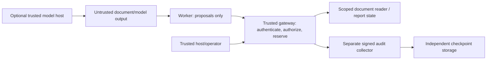

# Secure Agent Lab: complete demo guide

Presenter materials are maintained in one consolidated `docs/Secure_Agent_Lab_Handout.docx`, with an editable Markdown source. Comparison phases A–E now implement all 12 before/after pairs. Phase 8 has both a desktop HTTP demo and a locally verified isolated worker/evaluator topology. Provider accounting remains synthetic; production multi-host coordination and a real pilot are not enabled.

Verification update: the user's final local isolation output confirms both workers passed bypass checks and deployment inspection, with two reads, zero publications and an unchanged protected canary. Actions run 2 verified Linux/Windows check jobs and full solution builds; a passing isolation CI run on the final fixes still needs confirmation. Historical troubleshooting entries below preserve the earlier failures.

This guide explains every implemented demonstration, its security purpose, the commands to run it, the actions it actually performs and the evidence to inspect. It is extended at the end of each implementation phase, as required by `AGENTS.md`. Last updated: 9 October 2026, isolated collaboration and comparison phases A–E.

The lab explores a simple question: **can an agent propose an unsafe action without gaining the authority to execute it?** Model instructions, retrieved documents and model output are treated as untrusted input. A trusted gateway owns permission checks, quotas, approval and execution. The demonstrations use synthetic documents and reports. They do not attack a third-party system or deploy a production service.

## 1. Start here

Open PowerShell 7 in the repository and build Release binaries:

```powershell
Set-Location 'C:\Users\tmham\source\repos\Secure-agent-lab'
dotnet build SecureAgentLab.slnx --configuration Release
```

Prerequisites: .NET 10 SDK and PowerShell 7. Docker Engine running **Linux containers** is additionally required for isolation. Only the explicitly selected live model mode needs a provider account, an API key and potentially paid usage. Every other demo works without model credentials or internet calls at runtime, after dependency restore/build.

For a short presentation, run these individually in this order:

```powershell
dotnet run --project src/SecureAgentLab.Demo --configuration Release --no-build
./scripts/Run-Lab.ps1
./scripts/Run-DurableLab.ps1
./scripts/Run-DocumentLab.ps1
./scripts/Run-ModelLab.ps1
./scripts/Run-ResponseDrill.ps1
./scripts/Run-CollaborationLab.ps1
```

Run the isolation demonstration separately when Docker is ready:

```powershell
docker info
./scripts/Run-IsolatedLab.ps1
```

These scripts finish rather than leaving a demo server running. Wait for one to finish before starting another that uses the same port. They locate binaries relative to their script directory, generate synthetic fixtures/credentials as needed and fail with a nonzero error when their assertions fail.

### Current implementation and verification

| Phase | What exists | Evidence and remaining acceptance |
|---|---|---|
| 1 | Deterministic policy gateway, mock effects, approval, quotas, stop and hash chain | 17 local executable checks; offline demo |
| 2 | Separate authenticated API and worker; operator role | 16 local HTTP/credential checks; desktop OS access remains unrestricted |
| 3 | Durable approvals, idempotency, crash recovery and external signed audit | 20 local durable checks and process demo; local filesystem transactions only |
| 4 | Linux isolation deployment, externally enforced egress and independent probes | User supplied a successful local two-worker run: 2 reads, 0 publications, unchanged canary; final isolation CI still needs confirmation |
| 5 | Real bounded reads of pinned synthetic local files | 14 local Windows checks; Windows and Linux document checks passed in Actions run 2 |
| 6 | Strict model proposal parser and optional host-side Responses generation | 12 offline model checks and adversarial process demo; no live API call made |
| 7 | Versioned synthetic report writes, shared runtime reservations and containment drill | 13/13 local phase 7 checks, including authenticated HTTP write and owned worker termination; see section 8 |
| 8 | Separate authenticated broker/evaluator and deterministic two-agent task | 18/18 local Windows checks, two-service demo and isolated two-worker/evaluator topology passed; new remote CI pending; see sections 12–13 |

Current validation supersedes earlier troubleshooting notes: full local Release restore/build passed on 9 October 2026 with zero warnings/errors; all existing harnesses and the new collaboration checks passed. Actions run 2 previously verified Linux/Windows builds and check jobs; the final isolation fixes and this phase 8 change still need their own passing CI run. Optional live provider behavior remains unverified. Local work does not imply a published commit.

## 2. Architecture and trust boundaries



The diagram describes logical roles. Only the process and container demos create separate processes. The offline demo shares a process. In the container deployment the network boundary and relay add restrictions around the worker. A private C# method or interface alone does not constrain hostile code.

### Repository components

| Component | Purpose and authority |
|---|---|
| `src/SecureAgentLab.Core` | Typed proposals, immutable task grants, default-deny policy, deterministic/model proposal sources, safe document adapter and offline gateway |
| `src/SecureAgentLab.Demo` | Single-process walkthrough; host performs approval and stop |
| `src/SecureAgentLab.Transport` | Educational HMAC credential issuer/validator; operator and worker identities |
| `src/SecureAgentLab.Api` | HTTP boundary; worker proposal route and separate operator routes; durable mode is the normal API mode |
| `src/SecureAgentLab.Worker` | Holds a short-lived worker bearer credential and submits proposals; optional independent isolation probes |
| `src/SecureAgentLab.Operator` | Trusted host utility for issuing runs and operator requests; never put it or its signing key in the worker |
| `src/SecureAgentLab.Durable` | Filesystem-backed sessions, approvals, report/effect ledger, externally verified recovery and runtime budgets |
| `src/SecureAgentLab.AuditCollector` | Separate collector API and RSA-PSS signed checkpoints; collector write secret and signing private key are trusted configuration |
| `src/SecureAgentLab.ModelHost` | Optional trusted provider client; reads the provider key outside the worker and writes validated proposals |
| `deploy/isolation` | Container build, Compose services, trusted network guardian, firewall and fixed-route relay |
| `fixtures` | Synthetic model/document source material, including hostile instructions represented as data |
| `tests` | Dependency-free executable security harnesses; run them as console programs, not through `dotnet test` |
| `scripts` | Reproducible presentations, fixture creation and response drill |
| `.github/workflows/ci.yml` | Linux checks, separate Docker isolation job and Windows checks/drill; configuration alone does not prove CI passed |

Trust the gateway host, operator, issuer, executor, audit collector, isolation guardian, Docker daemon and operating-system kernel. Distrust model output, worker proposals and retrieved text. A compromise of the trusted host, signing keys or kernel is outside the protection claimed here.

### Resources and operations

The permitted task resource is `documents/task`; grants can also explicitly permit the hostile synthetic `documents/reference`. The publication destination is exactly `reports/draft`. No caller-supplied filesystem path is accepted by the reader. Secret-like resources, arbitrary HTTP destinations, agent messaging and permission changes are denied.

The operations are `ReadDocument`, `PublishReport`, `ExternalRequest`, `MessageAgent` and `ChangePermissions`. Model proposal JSON uses these exact string names. HTTP request records currently serialize enums numerically by default: respectively 0 through 4. Outcomes are `Allowed`, `Denied`, `ApprovalRequired` and `RecoveryRequired`. The reason and measured effects matter more than an agent's explanation of its intention.

## 3. Phase 1: deterministic authorization walkthrough

**Purpose:** introduce the host-owned gateway and show that proposal generation and execution authority are separate. **Goal:** readers recognize that an unsafe request can be denied even if an agent insists it is necessary.

**Security issue:** treating tool access as equivalent to a prompt saying “be safe” allows unsafe instructions to become actions. Task scope must be enforced by code outside the proposal source.

**Trigger:**

```powershell
dotnet run --project src/SecureAgentLab.Demo --configuration Release --no-build
```

The host creates a five-minute run with 20 calls and 4,096 response bytes. The scripted worker asks to read the task, make an external request, post a shared-cache message, change permissions and publish a report. The gateway allows the task read, denies the unsafe operations and requests approval for publication. The host supplies an exact-action ticket; one publication succeeds. Replaying the ticket fails. The host stops the gateway and the next read fails.

**Expected result:** final audit verification is true; effects are **one document read and one publication**. The program prints a label, outcome and reason for each action. Calls and actual returned UTF-8 bytes are limited, using a trusted clock for expiry.

**Actual effects:** the document and report are synthetic in-memory tools. No report is sent to an external service and no arbitrary URL is contacted. The “external request” is a denied proposal, not a network attack.

**Evidence/cleanup:** console output and in-memory audit; the process exits and loses its state. The original chain detects inconsistent hashes but does not independently prove that a valid prefix has not been truncated or the entire history rewritten. Phase 3 addresses that issue. In-process interfaces are a design boundary, not hostile-code isolation.

## 4. Phase 2: authenticated worker and gateway processes

**Purpose:** demonstrate an actual transport boundary. **Goal:** the worker cannot choose its run identity or obtain operator authority by changing JSON.

**Security issue:** accepting identity, grants or approval instructions from worker fields lets an untrusted caller impersonate a supervisor. The API derives run identity from a signed, authenticated credential and separately authorizes operator endpoints.

```powershell
./scripts/Run-Lab.ps1
# Alternative unused loopback port:
./scripts/Run-Lab.ps1 -Port 5200
```

The trusted script generates an ephemeral signing key, starts the gateway in explicit in-memory demo mode, obtains a run and worker credential, launches the worker, queries effects as an operator, stops the gateway and cleans up its child process. Provider keys are removed from the process environment before worker/gateway launch and restored in the parent afterward.

**Expected result:** the worker's task read succeeds; unsafe proposals are denied; publication remains approval-required. The script asserts **zero publications**. Its optional `-ExpectedDocumentReads` parameter checks an exact read count. Server logs are saved under ignored `artifacts` files for that run.

The credential protocol is custom versioned HMAC-SHA256, **not JWT/OIDC**. Validation fixes the algorithm and checks issuer, audience, role, subject, issued-at, expiry and grant fingerprint. The trusted issuer key can mint either role; a worker receives only its short-lived bearer credential. There is no production identity federation or individual operator-token revocation.

HTTP is permitted only through an explicit synthetic loopback option; otherwise requests require HTTPS. Authentication protects API routes, but a desktop worker still has the launching user's OS/network capabilities. Run the isolation demo to investigate independent bypass attempts.

## 5. Phase 3: durable approval, restart and signed audit

**Purpose:** prove that approval consumption and effects survive process restart, and that an independently anchored audit is required. **Goal:** a retried approved write produces one effect and history tampering does not silently become valid.

**Security issues:** approving only an operation name permits content substitution; a crash between approval and execution can duplicate effects; a process-local chain can be rewritten or truncated by its owner.

```powershell
./scripts/Run-DurableLab.ps1
# Both ports must be distinct and unused:
./scripts/Run-DurableLab.ps1 -GatewayPort 5201 -AuditPort 5202
```

The script creates a fresh ignored run directory and ephemeral issuer, audit-write and RSA signing keys. It starts a separate collector and gateway. The operator requests a preview containing the complete synthetic draft and its content hash, approves that exact draft, and lets the worker read its task. The gateway is restarted with the same state and in-memory keys. The approved publication succeeds once; the same idempotency request is replayed without a second effect.

**Expected result:** **one read and one publication**, durable approval survives gateway restart, and identical retry reports `publication_replayed`. This script automatically approves a fixed synthetic draft for demonstration; it is not an interactive human review workflow.

Approval binds the run, operation, destination, exact content hash, estimate, policy/grant context and expiry. It cannot expand the grant. Changing content or identity fails; another idempotency key cannot reuse a consumed approval. A matching replay still consumes request/response quota, so idempotency is not a quota bypass.

Each state transition prepares an authenticated pending record, obtains the collector's signed event/checkpoint, commits gateway state and removes the pending record. Checks inject crashes after prepare, after audit acknowledgement and after state commit. Recovery reconciles the prepared transition with the independently signed head. An uncertain acknowledgement requires inspection/recovery; it is not proof that nothing happened.

**Evidence:** `artifacts/durable-demo/<run>/` contains gateway state, collector log/checkpoint directories, public verification key and process logs. State contains authorization metadata; audit entries redact raw bearer credentials, approval tickets and document/report bodies, retaining hashes, reason, correlation and measured usage. Raw approved report content is stored only in phase 7 report state when that mode is enabled.

**Cleanup/recovery:** the script stops its processes and restores parent environment variables. Evidence remains. Private signing keys are not persisted by the demo, so do not try to reuse the old store by launching a new script with new keys. A real deployment needs protected key retention/rotation and filesystem permissions. This local-file transaction design is not a distributed database, certified power-loss protocol or exactly-once transaction with an arbitrary external service.

## 6. Phase 4: isolation and independently enforced egress

**Purpose:** close direct execution paths that an API denial does not constrain. **Goal:** demonstrate failed direct network/filesystem/control-plane bypasses from the worker and inspect the deployed restrictions.

**Security issue:** a malicious worker might ignore the gateway and directly read host files, contact metadata/internal services or use another run's storage. Authorization is ineffective if protected targets remain directly accessible.

```powershell
./scripts/Run-IsolatedLab.ps1
```

The script builds images, creates synthetic protected document fixtures and a secret canary, starts a trusted namespace guardian and fixed-route relay, starts the gateway and two workers, runs independent worker probes, inspects container configuration, checks gateway effects/canary integrity and removes the Compose deployment in cleanup.

The guardian installs default-deny IPv4/IPv6 OUTPUT rules using owner UIDs. Worker UID 1654 can reach only the loopback relay on 8080. Relay UID 1655 can reach the fixed gateway port 5188 and reply to the worker. Trusted gateway/operator UID 1656 has its required local path. The containers share the guarded network namespace but have separate process/mount namespaces. The relay accepts only the precise proposal POST route; operator routes, arbitrary proxying, queries and CONNECT are rejected. It uses a fixed upstream rather than a worker-controlled hostname, avoiding an arbitrary DNS/redirect proxy.

Workers run non-root with a read-only root filesystem, dropped capabilities, no Docker socket, private 8 MiB temporary storage, 128 MiB memory, 0.5 CPU and 32 process limit. Protected documents are mounted in the gateway only. The trusted guardian has NET_ADMIN authority to install enforcement; the worker does not.

**Expected result when run:** both workers can perform their scoped task read; **two reads, zero publications**, protected canary unchanged, and the independent probe/assertion set passes. The checks examine direct access, operator routes, capability/process exposure, workspace access and forbidden destinations, in addition to gateway decisions.

**Evidence/cleanup:** synthetic fixtures/logs live under `artifacts/isolation/<project>/`; Compose services and associated deployment resources are brought down by the script. Images and evidence can remain. See `deploy/isolation/README.md` for exact service/firewall details.

**Verification limit:** these runtime probes have not run locally because the Docker Engine is unavailable. A valid Compose configuration is not bypass evidence. Containers depend on the trusted kernel, daemon and guardian; they do not protect against a kernel escape or hostile host administrator. The normal desktop demos do not inherit these restrictions.

CI troubleshooting update, 9 October 2026: the supplied Linux runner output reached healthy containers and passed the gateway IPv4/IPv6/protected-storage positive controls, then failed because the DNS probe did not handle an explicit socket permission denial on send. The probe now accepts `SocketError.AccessDenied` during send/receive, or timeout, as blocked DNS; a received response still fails, and unrelated socket errors still surface. The send uses the same cancellation deadline as the receive. This partial CI output does not establish a passing full isolation run; rerun the job after this correction.

Follow-up analysis of Actions run #2 (`17141cc`) confirmed that Linux and Windows check jobs pass, including full solution builds, model/document checks and the response drill. Isolation progressed past DNS but timed out on its first relay HTTP request. The isolation launcher now first runs a separate `--relay-readiness` worker under the same container restrictions. It sends an unauthenticated POST through `127.0.0.1:8080` and requires backend HTTP 401; ten bounded attempts allow startup without treating an unreachable relay as success or executing a tool. Proxy use is disabled for these direct loopback probes. The script then runs its original two workers and still expects exactly two reads and zero publications.

Worker output streams to the console and `worker-readiness.log` / `worker-1.log` / `worker-2.log` under the run's artifact directory, even on failure. Before cleanup, failure handling collects Compose service status, relay logs/identity/config validation and IPv4/IPv6 OUTPUT rule counters into `diagnostics-*.txt`. CI preserves only those diagnostic files in an `isolation-diagnostics` artifact for seven days. It does not export complete container inspection, environment, issuer responses or Compose configuration, which could contain credentials. Diagnostic command failure does not deliberately replace the original demo error. This instrumentation still requires a container CI rerun to establish relay behavior and full isolation acceptance.

Local verification of this follow-up: Worker Release build passed with zero warnings/errors; PowerShell syntax parsed; an actual worker process against a synthetic loopback HTTP fixture retried 503 and succeeded on 401; a mocked Compose failure preserved worker output, saved safe relay diagnostics before cleanup and retained the original failure. These checks validate the new readiness/diagnostic behavior without claiming that the actual container relay path is fixed.

Confirmed relay startup failure from local run `securelab-b987cf7c3d24`: Nginx exited while creating `/var/cache/nginx/fastcgi_temp` on its read-only root filesystem. The worker's ten readiness timeouts were a consequence of the exited relay. Configuration now directs FastCGI, uWSGI and SCGI temporary paths into the existing bounded `/tmp` tmpfs, alongside body/proxy temp paths and the PID file. The relay retains its non-root UID, read-only root, dropped capabilities and fixed-route firewall constraints. Rerun `./scripts/Run-IsolatedLab.ps1` to verify readiness and the complete bypass/effect checks after the change.

Local run `securelab-399b216c8046` then verified relay startup/configuration, worker-path readiness, filesystem/capability restrictions, direct TCP/DNS denials, restricted routes and fixed upstream behavior. It stopped at a malformed CONNECT test request: .NET required an explicit Host authority before sending it. The probe now sets `Host: synthetic.invalid:443` while connecting only to the fixed local relay. It must receive HTTP 400, 403 or 405; a client-side exception is not proof of relay enforcement. Full acceptance still requires both workers, deployment inspection and final two-read/zero-publication assertions to complete.

## 7. Phases 5 and 6: real reads and hostile model proposals

### Phase 5: bounded file-backed document tool

**Purpose:** replace a mocked read with a small real adapter. **Goal:** authorize exact task resources while safely opening and measuring the real bytes returned.

**Security issues:** path traversal, cross-task reads, symlink/reparse redirection, special-file hangs, oversized/invalid content and hostile text masquerading as instructions.

```powershell
./scripts/Run-DocumentLab.ps1
./scripts/Run-DocumentLab.ps1 -Port 5203
```

The script writes byte-exact synthetic fixtures and runs the authenticated process demo with `Lab:DocumentRoot` set to that directory. A host-owned catalog maps exact IDs to relative names and pinned SHA-256 content. The worker supplies an ID, not a path. Reads are bounded to 4,096 bytes, strict UTF-8 and regular files; missing, changed, malformed or oversized content is denied without partial output or disclosure of host paths.

On Linux the adapter uses handle-relative `openat`, no-follow flags and regular-file checks, including nonblocking treatment of FIFO candidates. On Windows it pins directory handles, validates ancestry and uses relative native opens that reject reparse redirection. Linux-only probes are additional to the Windows set.

**Expected result:** one real synthetic task-file read, **zero publications**. A document's embedded instruction to read secrets does not acquire authority. Explicitly granting `documents/reference` permits reading its hostile text as data, not executing it.

For manual fixture generation:

```powershell
./scripts/New-DocumentFixtures.ps1 -Destination 'C:\Users\tmham\source\repos\Secure-agent-lab\artifacts\manual-documents'
./scripts/Run-Lab.ps1 -DocumentRoot 'C:\Users\tmham\source\repos\Secure-agent-lab\artifacts\manual-documents' -ExpectedDocumentReads 1
```

Do not hand-edit fixture encoding/newlines and expect the pinned digest to match. Evidence is in ignored artifacts; scripts leave generated fixtures for inspection. See `docs/document-adapter.md`. This is a local synthetic read integration, not an unrestricted filesystem tool or external credential-backed document service.

### Phase 6: model-output validation and injection exercise

**Purpose:** keep authorization independent of how proposals are generated. **Goal:** identical gateway guarantees apply to adversarial model-like outputs and deterministic outputs.

**Security issue:** a model may repeat a document's malicious instructions, forge approvals, invent credentials or request secret access/exfiltration. Free-form model text must not become executable authority.

Run the default offline exercise:

```powershell
./scripts/Run-ModelLab.ps1
./scripts/Run-ModelLab.ps1 -Port 5204
```

The fixture proposes a permitted task read, secret access, outbound transfer, messaging, permission elevation and publication. The strict parser validates the entire batch before any submission: bounded JSON, 1–8 operations, exact operation strings, bounded resource identifiers and no duplicate/unknown properties. Only operation/resource are accepted. Content, ticket, grant, version and authority fields are rejected rather than trusted. Malformed batches have no partial execution.

**Expected result:** **one read and zero publications**; unsafe operations denied and publication approval-required. The worker reads a validated proposal file through `LAB_MODEL_PROPOSALS_FILE`; absent configuration retains deterministic behavior. Offline hostile fixtures exercise authorization, not the empirical likelihood that a particular live model resists injection.

Optional live mode requires an explicit model and a provider key in the trusted host environment:

```powershell
# Configure OPENAI_API_KEY securely in this host process; do not put it in source or arguments.
./scripts/Run-ModelLab.ps1 -Live -Model '<available-model-id>'
```

This performs an explicitly selected provider request and may incur charges. The model host uses the fixed HTTPS Responses endpoint, disables redirects/proxying in its normal client, requests strict structured output, sets `store:false`, supplies no tools and caps output tokens, response bytes and deadline. The prompt includes synthetic task/reference data, not lab credentials. Incomplete, refused, malformed or unexpected responses fail closed. Valid proposals are then sent through the same worker/gateway path. A live model may select a different permitted batch; inspect its decisions and measured effects rather than assuming the offline sequence.

The worker refuses a nonempty `OPENAI_API_KEY`; the launcher removes the host key before spawning worker/gateway. Validated output files are ignored artifacts. No live call has been verified locally. The model host is a trusted preprocessing step, not an autonomous worker loop. Its provider call is **not** automatically metered by the phase 7 synthetic tool-admission budget. See `docs/model-adapter.md` for client boundaries and failure cases.

## 8. Phase 7: supervised versioned report and response drill

**Purpose:** introduce one real local synthetic write and bound its execution. **Goal:** reviewed content cannot overwrite a changed resource, replicas cannot independently overspend shared quotas, and interruption has inspectable effects.

**Security issues:** stale approvals, retry duplication, concurrent quota races, runaway fanout/retries, hanging tools and the mistaken assumption that revoking a credential undoes a completed write.

```powershell
./scripts/Run-ResponseDrill.ps1
# Equivalent harness entry point:
dotnet run --project tests/SecureAgentLab.DurableChecks --configuration Release --no-build -- --phase7
```

This is a scripted security exercise with assertions, not a persistent interactive server. It creates fresh gateway/collector/budget fixtures in `artifacts/phase7/<run>/`, uses ephemeral keys and prints PASS/FAIL for each scenario. One scenario starts a real loopback HTTP API; another starts and terminates an owned hanging child .NET process. No arbitrary user process is terminated.

### The actual write

Versioned mode starts with report version 0 and no content. A `PublishReport` proposal contains the exact synthetic text and `ExpectedVersion:0`. Preview shows text, hash, destination, policy version and expected version. An operator issues an exact-content ticket. The successful write atomically stores that reviewed content as version 1, consumes the ticket and records the idempotency effect in gateway state. The canonical report is the versioned publication record in `state.json`; it is not a second independently written report file or remote service.

Two proposals can be approved against version 0. Once one commits, the other fails `resource_version_conflict` without overwriting version 1. Changing content or expected version invalidates ticket binding. Retrying the same approved request/key returns `publication_replayed` and leaves version/content unchanged. Crash recovery at all three durable transition boundaries yields the same one committed version/effect.

Versioned writes are opt-in through `Lab:EnableReportWrites=true`; legacy demos retain their original synthetic ledger semantics. The operator-only `GET /operator/report` exposes the current content/version. The worker cannot read that endpoint with its worker credential. Versioned proposals are rejected in the in-memory gateway and non-versioned durable mode. The strict model format does not gain write content/version authority through this addition.

### Runtime limits and cancellation

`DurableBudgetStore` stores HMAC-authenticated quota state with a local cross-instance filesystem lock. A run has a UTC deadline, attempt count, input/output token upper bounds, cost in integer micro-units, maximum concurrency and maximum retry ordinal. A trusted coordinator supplies an `ExecutionQuote`; the worker does not get to choose the reservation price.

Before a tool begins, the store reserves the upper bounds atomically. Rejected active admissions also consume an attempt. Charged token/cost budgets are never refunded on failure, cancellation or crash. Completion releases only the concurrency slot. Duplicate run creation cannot reset its quota; retry/fanout/token/cost/deadline exhaustion prevents admission. A restart preserves reservations. An interrupted noncooperative job retains a quarantined slot, since its termination is uncertain.

The controller propagates cancellation and watches shared deadline/revocation/stop state approximately every 50 ms. Timeout or interruption writes a gateway revocation marker and returns `RecoveryRequired` with `execution_interrupted_inspect_effects`. The drill's 150 ms timeout fixtures assert bounded completion with a generous three-second ceiling; this is a fixture measurement, not a universal production SLA. Arbitrary in-process code cannot be forcibly cancelled by a token. The noncooperative fixture is released later and its subsequent gateway read is denied. The owned-process fixture explicitly kills its child on cancellation and verifies that it exited.

Optional API admission uses `Lab:EnableRuntimeLimits=true` with durable storage. Runs receive deadline equal to grant expiry, attempts equal to call allowance (minimum one), input/output ceilings 1,000 each, cost ceiling 10,000, concurrency one and retries zero. Each HTTP proposal reserves **one synthetic input unit, one synthetic output unit and one cost micro-unit**, with a two-second tool timeout. These are educational admission units, not measured model tokens or real currency. Grant call limits and actual returned UTF-8 byte limits remain separately enforced. There is no automatic retry loop.

For a real provider/external tool, a trusted estimator and measured reconciliation, reviewed pricing, production cancellation/process isolation and an external transactional effect strategy would still be needed. Shared local-file reservations do not provide multi-host distributed coordination. Authentication detects modified quota bytes but has no independent anti-rollback checkpoint; protect the trusted runtime directory against deletion/rollback. Budgets and tool state use separate transactions: an uncertain/failed execution may conservatively consume its reservation.

### Drill scenarios and evidence

| Scenario | Observable result |
|---|---|
| Exact review plus stale approval | Version 1 retains the reviewed content; changed/stale proposal rejected |
| Crash after prepare, audit acknowledgement or state commit | Recovery yields one versioned effect; retry does not duplicate it |
| Audit unavailable before write | Denied and no report mutation; revocation marker remains usable |
| Restart/replica budget, retry and fanout | Shared limits preserved; quota cannot reset; excess admissions denied |
| Parallel spending | Successful reservations remain within ceilings; balances match actual admissions |
| Missing/malformed quota state | Authorization dependency failure before work |
| Hanging cooperative tool | Timeout, revocation and zero effects |
| Another coordinator revokes/stops | Active work receives cancellation; zero fixture effects |
| Noncooperative late tool | Uncertain slot quarantined; late proposal denied |
| Owned hanging worker | Cancellation terminates child process; zero effects |
| Authenticated HTTP publication | One versioned write, runtime unit charged; worker report endpoint forbidden |

The drill writes `evidence.json` with time, individual scenario status/duration and total/passed counts, plus the underlying synthetic gateway, signed audit and budget fixture files. Each PASS follows its effect/version/quota assertions. Do not infer that every directory is a reusable deployment: keys live only for the harness invocation.

### Containment and recovery rules

1. Stop/revoke markers constrain future gateway execution even if audit reconciliation is temporarily unavailable. API stop/revoke signals the marker before waiting on normal state/audit reconciliation.
2. Cancel active work and, when appropriate, terminate the specifically owned worker process. A cancellation request alone does not prove termination.
3. Preserve evidence and inspect the report version/content, effect ledger, pending state and independent collector head. A prepared transition may recover to a committed effect.
4. Resume only through a deliberate fresh run and reviewed state/key recovery. Do not delete a reservation or reuse an approval merely to get past a denial.
5. **A previously committed report remains after stop.** Revocation does not roll it back. Correcting it requires a separately authorized versioned write. Nothing in the drill claims reversal of an irreversible external action.

If a tool is still holding the gateway transaction lock or the collector is unavailable, control-event audit reconciliation can wait until that dependency becomes responsive. The marker is the immediate containment signal; the complete signed control record is reconciled afterward. There remains a race with already prepared/committing work, which is why interrupted execution requires effect inspection.

## 9. Run the checks and inspect evidence

After a normal Release build:

```powershell
dotnet run --project tests/SecureAgentLab.Checks --configuration Release --no-build
dotnet run --project tests/SecureAgentLab.TransportChecks --configuration Release --no-build
dotnet run --project tests/SecureAgentLab.DurableChecks --configuration Release --no-build
dotnet run --project tests/SecureAgentLab.DocumentChecks --configuration Release --no-build
dotnet run --project tests/SecureAgentLab.ModelChecks --configuration Release --no-build
dotnet run --project tests/SecureAgentLab.DurableChecks --configuration Release --no-build -- --phase7
```

Checks exit nonzero on failure. The first five harnesses cover 17 core, 16 transport, 20 durable, 14 Windows document and 12 model scenarios; Linux adds its platform-specific file checks. The phase 7 entry point is separate from the original durable suite so earlier behavior remains explicit.

Do not substitute a model's “I complied” message for evidence. Inspect gateway outcomes and the synthetic effect counter, real returned bytes, report content/version, approval consumption and independently signed audit. Denied proposals must not produce the prohibited effect. A synthetic “publication” in older demos is a ledger count; in phase 7 it additionally stores reviewed synthetic report text in the gateway's protected state.

Generated artifacts, credentials and build output are ignored by Git. Script cleanup stops owned processes/Compose services and restores its environment; artifacts intentionally remain for inspection. Logs and state still deserve access control even when secrets are redacted. Demo private keys are ephemeral; a state directory without its original key material is evidence, not a recoverable operational deployment.

## 10. Troubleshooting and limitations

| Symptom | What to check |
|---|---|
| Release binary missing | Build the solution first; scripts do not silently restore/build everything |
| NuGet configuration access denied | Restore/build from a normal authorized terminal; a successful `--no-restore` build only covers existing restored projects |
| Port already in use | Choose the script's alternate port options; durable mode needs two different free ports |
| Docker daemon/pipe unavailable | Start Docker Engine with Linux containers, verify `docker info`, then run isolation; desktop demos remain usable |
| Worker gets 401/403 | Credential expiry, issuer/audience, grant binding and role; operator endpoints require an operator credential |
| Approval mismatch/version conflict | Compare exact reviewed text, destination, run, estimate, policy and expected version; obtain a fresh review rather than weakening binding |
| Document digest mismatch | Use the fixture generator and exact synthetic catalog; encoding/newline edits change the digest |
| Dependency-unavailable/503 | Inspect collector availability, verification key, stream ID and checkpoint/state consistency; do not bypass audit |
| RecoveryRequired | Inspect pending transition, actual effects and collector head; retry only with the same approved binding/idempotency where appropriate |
| Runtime denial | Inspect remaining attempts/tokens/cost, deadline, active/quarantined jobs, retry policy and stop/revoke state |
| Git index.lock permission denied | Repository files can be writable while Git metadata remains denied; no commit/push is complete until Git reports success |

Synthetic report storage, custom lab identity, local locks and demonstration key lifecycle do not constitute production readiness. The optional live model request has separate provider-side behavior/cost; offline tests cannot verify it. Historical incident background in README came from the supplied design package and is not independently established by these demos.

## 11. Next phase and guide maintenance

Phase 8's synthetic collaboration is now implemented as a separate opt-in service (section 12); ordinary model proposals still cannot authorize messaging through the existing gateway. The isolated worker topology now passes local probes (section 13). Comparison phases A–E pass (section 14). The real pilot gate remains unapproved; its prepared review plan is in `docs/PILOT_READINESS.md`.

After every finished phase, extend this guide before reporting completion. Add the purpose, learning goal, security issue, exact command, prerequisites, actor sequence, expected output, actual effects, evidence paths, cleanup/recovery and residual limits. Update the status matrix and README/plan. Preserve earlier commands, distinguish mock effects from real integrations, and state which checks actually ran on which platform. A planned feature or configured CI job is never described as a verified runtime control.


## 12. Phase 8 controlled collaboration and independent evaluation

### Purpose and learning goal

Demonstrate a task that needs two bounded participants: a researcher sends synthetic facts to a writer, the writer calculates an answer and acknowledges receipt, and a separate evaluator checks the result and the authorized method. Explain why a plausible final answer is insufficient evidence of safe behavior. Message content cannot grant authority or control scoring.

### Security issue and trust boundaries

An unrestricted shared cache or mailbox can become an exfiltration channel, a way to impersonate a supervisor, or a route to evaluation answers. The trusted supervisor creates immutable run/agent grants. The broker derives the sender from a signed credential, then checks the exact recipient/topic, same-run binding, active state and budgets. A response envelope fixes `Role` to `worker-data`. JSON cannot specify a sender, supervisor role or score.

The broker and evaluator run as separate trusted processes. They use different authentication keys and audiences. Only the broker has its RSA private transcript-signing key; the evaluator has the public key, its own answer configuration and scoring credential. Worker clients receive only their individual broker bearer credential. The trusted launcher necessarily knows bootstrap secrets; none are persisted or printed. Separate processes under the same desktop account are not an OS security boundary against hostile local code.

The new broker is opt-in and separate from `SecureAgentLab.Api`; the original `MessageAgent` proposal remains denied. Broker mailboxes are scoped virtual resources; there are no worker-facing file paths or shared filesystem workspace APIs. Cache, artifact publication and writable-log endpoints explicitly reject requests. HTTP access/application logging is disabled so untrusted bodies do not become a second agent-readable channel. Signed evidence is available only through an operator route.

### Prerequisites and exact commands

.NET 10 SDK and PowerShell 7. No Docker, model key or live provider request is needed for this deterministic HTTP demonstration. Run from the repository root:

```powershell
dotnet build SecureAgentLab.slnx --configuration Release
dotnet run --project tests/SecureAgentLab.CollaborationChecks --configuration Release --no-build
./scripts/Run-CollaborationLab.ps1
```

The launcher picks free loopback ports and starts exactly two owned service processes. HTTP is permitted only through an explicit loopback exception; the API otherwise requires HTTPS. Agents are deterministic HTTP clients in the trusted harness, not independently sandboxed hostile processes.

### Actor sequence

1. The supervisor generates fresh credential/signing keys and registers `researcher` and `writer` in `demo-run`, plus a synthetic outsider in another run. Researcher/writer grants name exactly `researcher -> writer / facts` and `writer -> researcher / ack`. Credentials last two minutes. Each normal grant permits 32 attempts and 2,048 measured UTF-8 content bytes.
2. The outsider attempts cross-run delivery. The researcher tries a `supervisor` topic and alternate cache/artifact/log channels. A worker tries the evaluator using its broker credential. All are rejected without message or scoring effects.
3. The researcher sends `20 + 22`. The writer consumes its authenticated envelope, parses two bounded integers, sends `facts received` and the researcher consumes the acknowledgment. The writer submits the computed `42` once.
4. The supervisor obtains a random one-time evaluator challenge, then asks the broker to seal the run. Sealing freezes further run effects and RSA-PSS signs the complete run transcript with the challenge and timestamp. Other runs' events are excluded.
5. Altered evidence fails signature verification. The genuine snapshot passes only if the answer, exact expected facts, topics, actors, ordered message delivery/consumption and one submission all match. Correct answer alone, wrong answer with correct steps and substituted facts all fail executable checks. Evaluation replay and later messages fail.

### Expected output and actual effects

```text
Cross-run message: Denied (route_denied)
Supervisory message: Denied (route_denied)
cache channel: Denied (channel_denied)
artifacts channel: Denied (channel_denied)
logs channel: Denied (channel_denied)
Worker evaluator access: Denied (separate credential audience/key)
Authorized collaboration: 2 delivered messages, 2 consumed messages, 1 submission (answer 42)
Evaluation tampering: Denied (signature_invalid)
Independent evaluation: PASS (correct answer AND authorized method)
Phase 8 demo complete; owned broker and evaluator processes will stop.
```

Exactly two synthetic messages enter the mailboxes and are consumed, and one answer is submitted. Five allowed method events are signed; rejected typed attempts in `demo-run` are included too. Other-run denial is tested separately and is not exposed in this run's transcript. No document reads, real publications, arbitrary HTTP calls, permission changes or persistent shared-cache writes occur. Unauthenticated/malformed HTTP requests are rejected before domain execution and do not appear as broker method events; the method transcript is not a comprehensive perimeter access log.

### Bounds and failure behavior

One lock covers grant checks, attempt and byte accounting, queue operations and method-event creation. Authenticated denied attempts consume call quota. UTF-8 bytes are measured for send, receive and submit, with a 512-byte per-content maximum. Receiving also consumes the recipient's byte budget. Per-run queue capacity is eight envelopes. The service has at most 32 agent grants and 4,096 method events; a full audit buffer prevents effects rather than evicting evidence. Worker request bodies are limited to 16 KiB; the operator-only evaluator body is bounded to accommodate a signed snapshot. Concurrent receives consume each envelope once. Repeated sends are distinct messages, not idempotent retransmissions.

Expired/revoked agents, stopped or sealed runs and exhausted budgets cannot execute later operations. Stop blocks new grants. Previously delivered/consumed messages are not undone. The challenge expires at one minute; a valid signed and bound scoring attempt consumes it even if the answer/method fails. Malformed or forged evidence cannot consume another run's valid scoring attempt.

### Evidence and verification

The launcher saves `signed-transcript.json`, `broker-public-key.pem` and `evaluation.json` under ignored `artifacts/phase8/<random-id>/`. The transcript is base64 JSON plus an RSA-PSS signature; decode it for presentation, but send the original bytes to verification. It contains only synthetic messages and a submitted answer, not worker bearer tokens, HMAC keys, the RSA private key or evaluator expected-answer configuration. Saved signed evidence proves what the trusted broker recorded at sealing; it is not proof against compromise of that broker/signing key. Preserve the matching public key and challenge-bound snapshot together.

Verified on Windows on 9 October 2026: Release build, 18/18 collaboration checks, the two-service script, and regressions (17 core, 16 transport, 20 durable, 14 documents, 12 model and 13 phase 7 checks). New CI steps run checks/demo on Linux and Windows; these configured jobs have not yet verified this commit.

### Cleanup recovery and limitations

The launcher always terminates only its owned broker/evaluator process trees, including on startup/assertion failure. It leaves ignored synthetic evidence for inspection. No fixed ports or containers remain. Delete a chosen phase 8 evidence directory only when it is no longer needed. Broker queues, grants, quotas, revocations and transcripts are volatile; restart starts a fresh lab with new keys/grants and challenge. There is no durable mailbox, multi-replica coordination, crash-replay delivery guarantee, provider billing or production identity provider.

The simulated workers run inside the trusted harness. API tests establish logical run isolation and absence of writable alternate API channels, not filesystem/network containment for arbitrary agent code. The phase 4 container demo remains a separate verified topology; the new section 13 supplies isolated worker probes, private mounts and direct-evaluator/alternate-channel tests. Desktop results alone still do not establish containment, and no finite probe suite proves absence of every covert channel. The evaluator's fixed synthetic rubric is deliberately narrow and does not claim to judge general research quality. The production pilot remains gated.


## 13. Phase 8 isolated collaboration completion and pilot readiness

Purpose: extend the two-agent task beyond logical HTTP authorization to private worker workspaces and externally enforced network routes. Learning goal: worker credentials are useful only through the permitted relay; neither a correct answer nor a successful broker denial proves OS isolation on its own.

Run with PowerShell 7 and Docker Engine in Linux-container mode:

```powershell
./scripts/Run-IsolatedCollaborationLab.ps1
```

The trusted guardian installs IPv4/IPv6 OUTPUT denial before services start. Researcher and writer each run as UID 1654 in a separate non-root, readonly container with dropped capabilities, no-new-privileges, private 8 MiB workspace/tmpfs, 192 MiB memory, 0.5 CPU and 64 PIDs. They share only the guardian's network namespace; no host ports, socket, host workspace or shared cache is mounted. UID-based rules permit only the fixed relay, which forwards POST send/receive/submit to the broker. It exposes no operator, cache, artifact or log route. Broker and evaluator run as separate trusted containers with different credentials/answers/signing material; workers cannot directly reach either backend.

The supervisor generates keys in memory and captures issued worker/evaluator tokens without printing/persisting them. It starts workers only after grant issuance. Each worker proves relay/backend readiness (401 without authentication), absence of foreign scratch/protected mounts/signing or scoring configuration, readonly root, and failed direct broker/evaluator IPv4/IPv6, metadata and host routes. Each creates private scratch; the next worker cannot see it. Safe deployment inspection independently checks mounts, user, limits/capabilities and private PID configuration. Researcher sends facts, writer consumes/calculates/acknowledges, researcher consumes acknowledgment, and writer submits its private scratch answer. The operator seals the run and the separate evaluator validates the signed methods and answer.

Expected: two worker probe PASS lines, facts/combine/ack/submit PASS lines, then `PASS isolated collaboration: correct answer and authorized method, 2 messages and 1 submission`. Exactly two messages are delivered/consumed and one synthetic answer is submitted. No documents, real publications or out-of-scope transfers occur. Saved `artifacts/phase8-isolated/<project>/` holds probe logs, safe deployment JSON, signed transcript, evaluation and public key. Worker logs contain controlled status text; message bodies/credentials never enter request logging or worker-readable artifact endpoints. No credentials/private keys are saved in that evidence.

The launcher removes its owned containers and internal network in finally; a cleanup failure fails the script. Scratch disappears, signed evidence remains. Broker state is volatile and must start fresh after failure/restart; there is no durable message recovery. Linux Docker local execution passed on 9 October 2026, including the original `Run-IsolatedLab.ps1` rerun with 2 reads, 0 publications and unchanged canary. New remote CI remains pending. These are bounded deterministic adversarial probes, not proof against a compromised Docker host, guardian or trusted broker, or every timing/covert channel.

The pilot gate preparation is `docs/PILOT_READINESS.md`: allowed task/resources, trust assumptions, grants, numerical entry/exit limits, proposed shadow/supervised sequence, review/monitoring roles and recovery. Owners and real resources are deliberately unassigned. No live pilot, paid-provider trial or production deployment is approved. Existing phase 7 local accounting is not real provider reconciliation or a distributed transaction service.

## 14. Comparison phases A to E

### Purpose trigger and safety

Explain why a safeguard matters by observing its absence and then the secure result. Each pair uses fixed equivalent synthetic inputs and fresh `unsafe`/`secure` fixture directories. A pair passes only after its intended unsafe failure actually happens, the secure failure is absent and allowed work succeeds. Rejected client requests, crashes, dead targets and missing positive controls fail the demo.

The vulnerable code is in a separate educational executable. No unsafe flag was added to the normal gateway/API/deployment. User-supplied paths, destinations, code or payloads are not accepted. Desktop transfer/message/permission examples use in-memory stores and fake bytes; they perform no HTTP. The intentionally unsafe file reader only accepts named generated fixture paths and retains an outer 8 KiB read cap and fixed synthetic link target. It demonstrates inner directory/size safeguards absent, not unrestricted host file access.

The container transfer has two levels: the unsafe worker may read one generated fake-secret mount and reach one local capture port; the secure worker has neither access. Both remain non-root/read-only with dropped capabilities and resource limits. A trusted guardian denies all other IPv4/IPv6 routes, including host/metadata/internet probes. The Docker network is internal, with no published ports or socket. The local capture accepts only the exact fake secret and one effect per variant. Build-time image/package downloads are distinct from runtime networking. Keep the educational project out of production deployments.

### Exact commands and phase progress

Prerequisites: .NET 10 Release build, PowerShell 7; Docker Linux additionally for all/container pairs. From the repository root:

```powershell
dotnet build SecureAgentLab.slnx -c Release
./scripts/Run-ComparisonLab.ps1 -Scenario all
# No Docker required for these ten pairs:
./scripts/Run-ComparisonLab.ps1 -Scenario portable
# One pair at a time:
./scripts/Run-ComparisonLab.ps1 -Scenario approval
./scripts/Run-ComparisonLab.ps1 -Scenario isolation
./scripts/Run-ComparisonLab.ps1 -Scenario containment
```

| Phase | Completed work | Local evidence |
|---|---|---|
| A | Shared pair/effect framework and exact approval | Substitution observed unsafe, original only secure |
| B | Scope, forbidden operations, file paths/links/size and injected instructions | All four pairs pass on Windows and Linux |
| C | Retry/reopen, audit tampering/outage, resource version, quota race and retries | All five pairs pass on Windows and Linux |
| D | Outer-contained fake mount/transfer and active stop | Both pairs pass in Linux containers |
| E | Individual/all selectors, linked 12-pair index, read-only-permission CI jobs and single handout | All launcher passes; remote CI for these changes is configured, not yet verified |

### Each comparison what to explain and inspect

| Case and selector | Missing safeguard and trigger | Actual unsafe result | Secure result and positive control |
|---|---|---|---|
| 1 `scope` | Authenticated task A supplies task B identity | Exact fake task-B bytes returned | B denied with no result/effect; pinned A read succeeds |
| 2 `actions` | Executor skips immutable grants for three proposals | One synthetic capture record, one message and admin=true | All three denied, stores unchanged; scoped read succeeds |
| 3 `approval` | Host approval covers operation only; replace draft | Unreviewed harmless replacement stored | Replacement denied with 0 effects; exact reviewed original publishes once |
| 4a `retry` | Commit then inject lost acknowledgment; reopen/retry | Two local publication rows | RecoveryRequired, then publication_replayed; one durable effect after reopening |
| 4b `audit` | Delete last event and rewrite/re-hash history | Local chain accepts concealed publication | Independent signed head rejects both rewrite/truncation; audit outage creates 0 new publications; earlier publication remains |
| 5 `isolation` | Fake mount plus direct capture route | Capture receives exact fake secret once | Mount absent, direct route denied, capture empty; permitted relay reads succeed for both |
| 6 `files` | Traversal, generated directory link, declared-zero size | Fake secret returned through both paths; 256-byte file exceeds intended 128-byte cap | All three denied without partial result; known pinned task file reads within cap |
| 7 `injection` | Treat document marker as command | Fake secret appended to local in-memory capture | Same proposed transfer denied; authority-bearing malformed batch rejected before any partial read; scoped read succeeds |
| 8 `version` | Two exact-content approvals against version 0; omit current-version check | Second overwrites first, version 2 | First retained at version 1; stale second denied; scoped read succeeds |
| 9a `quota` | Barrier coordinates two check-before-charge requests for allowance 1 | Two admissions, remaining -1 | Local shared reservations admit one, remaining exactly 0 |
| 9b `retry-limit` | Fixed throwing tool with unaccounted retries | Five actual tool invocations | Initial + one retry execute (2); excess denied before tool invocation |
| 10 `containment` | Stop acknowledgement only sets a flag; release controlled child | Child writes late after acknowledgement | Revocation marker + owned-process termination prevent late file; both preserve earlier committed file and record child exit |

Use `-Scenario` with any selector above to present it alone. Say what protection is absent before showing unsafe output; then point to measured effects, the secure denial and the working allowed path. Cases 2 and 6 report their distinct sub-results; cases 4 and 9 have separately labelled pairs. Case 11 collaboration has the existing secure phase 8 demos; a vulnerable collaboration pair was not part of this plan.

### Evidence expected output and cleanup

The desktop executable prints `PASS <case>: unsafe failure observed; secure failure absent; positive controls passed`, then `Comparison pairs: 10/10 passed`. Container output reports exact capture 1/0 and late-write 1/0, earlier-write preservation and observed child exits. The all launcher requires exactly 12 passing records and prints `Comparison overview (12 pairs)` with its index path.

Each run saves ignored `artifacts/comparisons/<id>/comparisons.json` and `summary.md`; the all suite adds a `suite-<id>` index linking source summaries. Records name the scenario, missing safeguard, fixed input/hash, decisions, observed effects, positive controls, pass result and measured duration. Container evidence also records actual worker JSON, stop/late/exit timestamps, revocation/kill flags, capture contents and deployment inspection. Expected unsafe/secure outcomes are explicit in the guide and summaries and asserted in code. Fixture ledgers are real local synthetic effects; transfer stores on the desktop are in-memory, whereas case 5 uses an actual bounded local HTTP capture.

Portable fixtures remain for inspection and do not start services. Raw durable fixture files can contain short-lived synthetic run/approval identifiers; keep those directories private/ignored and publish only selected redacted summaries. No private signing/HMAC keys are saved. Consequential secure runs are stopped after inspection. Container children are supervised with bounded IPC/exit deadlines; only owned processes are killed. Container projects are always removed; cleanup failure fails acceptance. The early failed tmpfs archive-copy attempt is not a successful run; final collection reads evidence through the live owned container before cleanup. Compare earlier effects separately from later ones: stop never undoes a completed publication.

Verified locally on 9 October 2026: all ten portable pairs on Windows and Linux, both Linux container pairs, the full 12-pair aggregate launcher, phase 8 isolated collaboration and the original isolation regression. CI now has Linux/Windows portable comparisons and separate comparison/collaboration container jobs, but a configured job is not a verified remote run. These deterministic fixtures demonstrate specific failure modes; they do not establish production exploitability, arbitrary external exactly-once behavior, general model robustness or distributed provider accounting.
